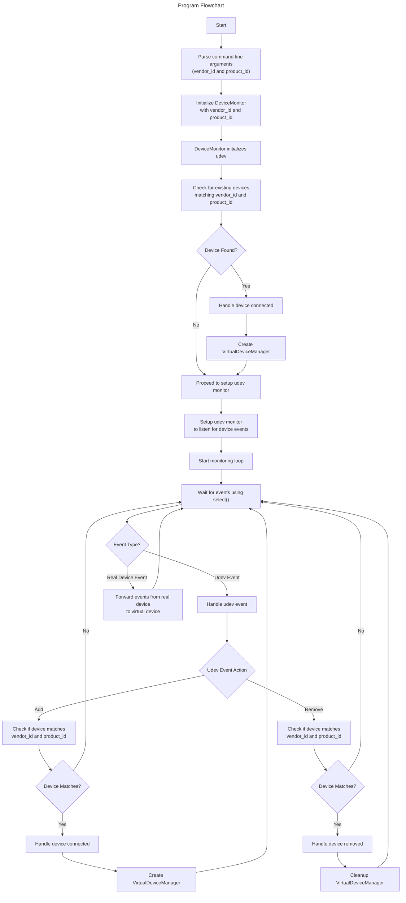

# What is this?

This application was built to address a limitation in SDL2, which doesn't detect devices without buttons as game controllers. Specifically, it was developed for the Thrustmaster Pendular Rudder (TPR), a device with 3 axes but no buttons. By adding a virtual button to the device, the application allows it to be detected and used in Linux and Wine games, enabling proper interaction through SDL and Dinput.

# Tested on

## Operating System

* Linux Mint 21.3 (Based on Ubuntu 22.04)

## Devices
Thrustmaster Pendular Rudder (TPR)

# Notes

## Items used to figure out what's going on:

| Code | Function |
| --- | --- |
| ```udevadm monitor --udev``` | Show the device connect/disconnect events |
| ```lspci``` | Show the usb device connections (good to understand tree of usb hubgs connected to usb hubs before devices) |
| ```lsusb``` | Show the currently connected devices and their corresponding vendor + product id's |

## Todo

* Add testing
* Build github actions environments for test and release construction for:
 * Debian
 * Arch
 * Centos/Fedora/Redhat



